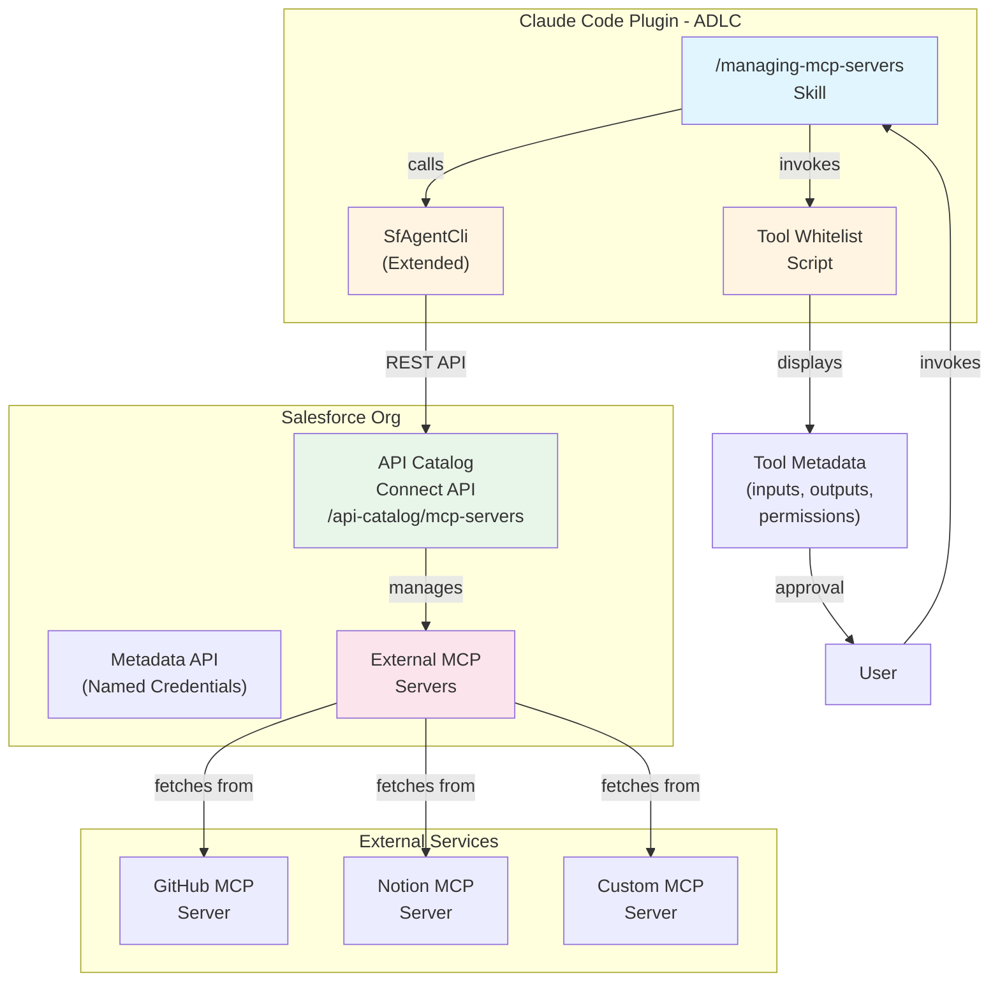
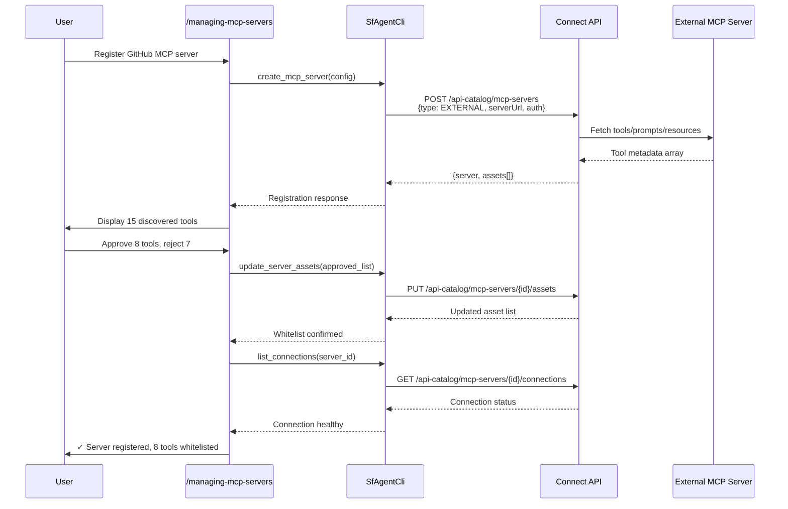
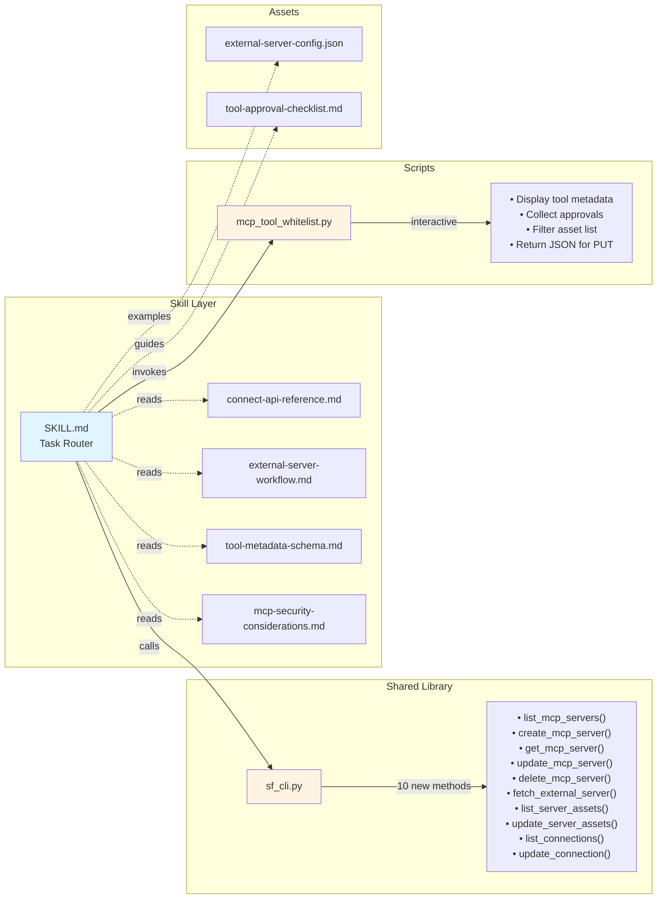
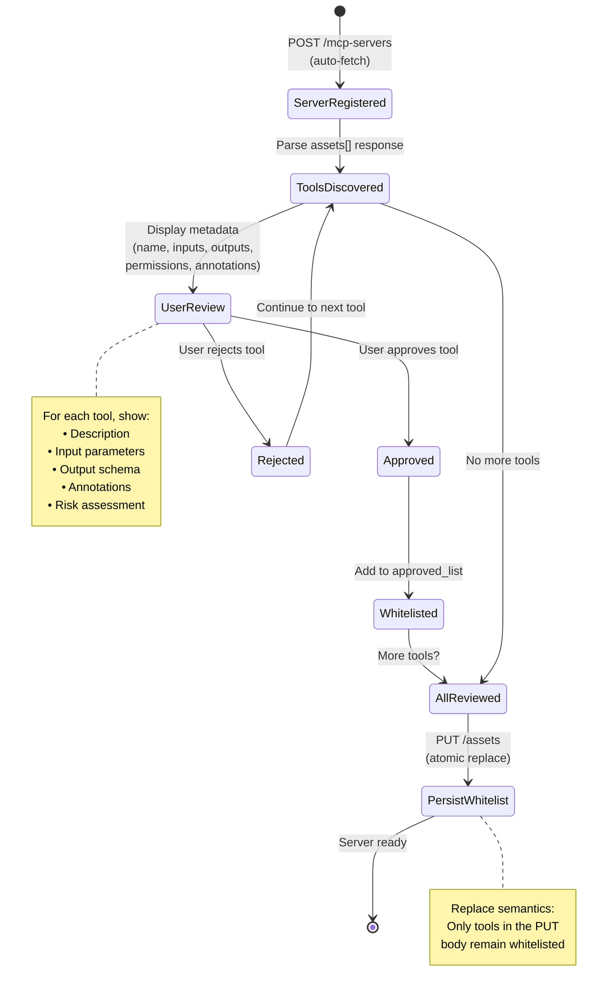
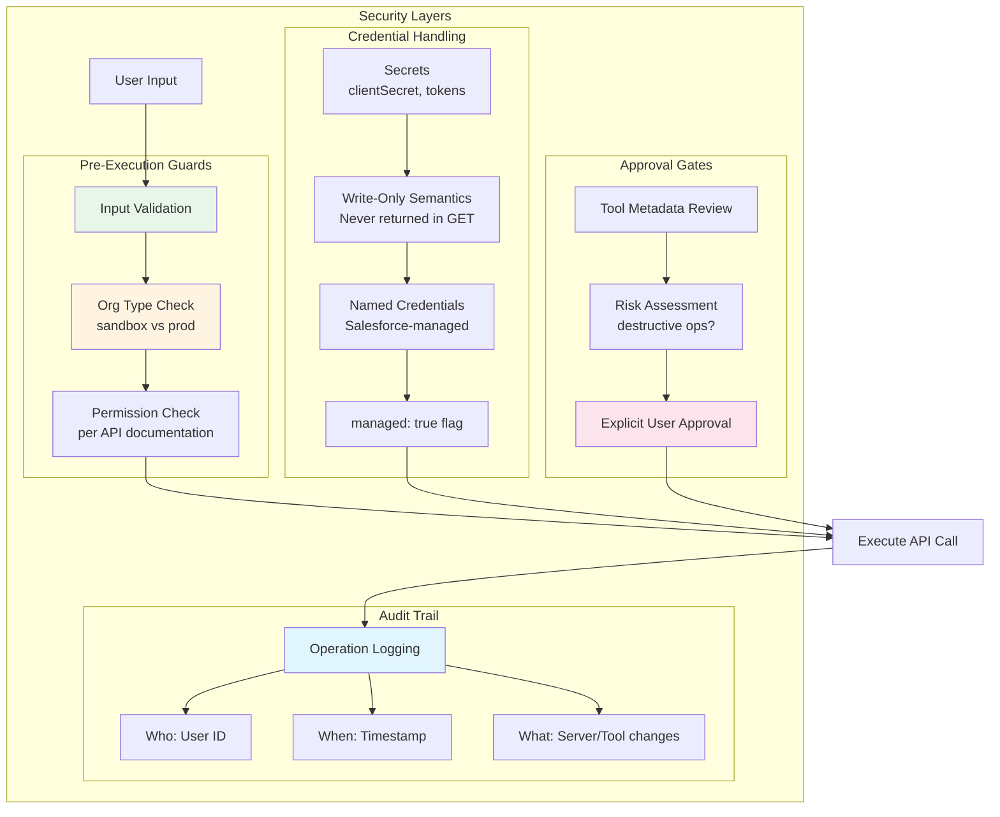

# MCP Server Management Architecture

## System Overview



## Data Flow - External Server Registration



## Component Architecture



## Tool Whitelisting State Machine



## Re-Sync Workflow

```mermaid
flowchart TD
    Start([User triggers re-sync]) --> Fetch[POST /{id}/fetch<br/>Stateless read-through]
    
    Fetch --> Parse[Parse response:<br/>storedInCore flag]
    
    Parse --> Categorize{Categorize tools}
    
    Categorize -->|storedInCore: false| New[NEW TOOLS<br/>Not yet whitelisted]
    Categorize -->|storedInCore: true| Existing[EXISTING TOOLS<br/>Previously whitelisted]
    Categorize -->|In whitelist,<br/>not in fetch| Removed[REMOVED TOOLS<br/>No longer on server]
    
    New --> Display[Display delta to user]
    Existing --> Display
    Removed --> Display
    
    Display --> Review{User reviews changes}
    
    Review -->|Approve new tools| AddNew[Add to approved_list]
    Review -->|Keep existing| Keep[Retain in list]
    Review -->|Remove obsolete| Drop[Remove from list]
    
    AddNew --> Update[PUT /{id}/assets<br/>Atomic replace]
    Keep --> Update
    Drop --> Update
    
    Update --> Done([Re-sync complete])
    
    style New fill:#e8f5e9
    style Existing fill:#fff4e1
    style Removed fill:#fce4ec
    style Update fill:#e1f5ff
```

## Security Architecture



## Integration with Existing Skills

```mermaid
graph LR
    subgraph "Existing Skills"
        Dev[/developing-agentforce]
        Test[/testing-agentforce]
        Obs[/observing-agentforce]
    end
    
    subgraph "New Skill"
        MCP[/managing-mcp-servers]
    end
    
    subgraph "Use Cases"
        UC1[Agent needs external<br/>MCP tools]
        UC2[Configure agent-MCP<br/>connections]
    end
    
    Dev -.may reference.-> MCP
    MCP -.provides tools for.-> Dev
    
    UC1 --> Dev
    UC1 --> MCP
    
    UC2 --> Dev
    UC2 --> MCP
    
    style MCP fill:#e1f5ff
    style Dev fill:#e8f5e9
```

---

**Diagrams rendered**: 7 total
- System overview
- External server registration sequence
- Component architecture
- Tool whitelisting state machine
- Re-sync workflow
- Security architecture
- Integration with existing skills

**Note**: Platform server support removed per project requirements. This architecture focuses solely on external MCP server management.
